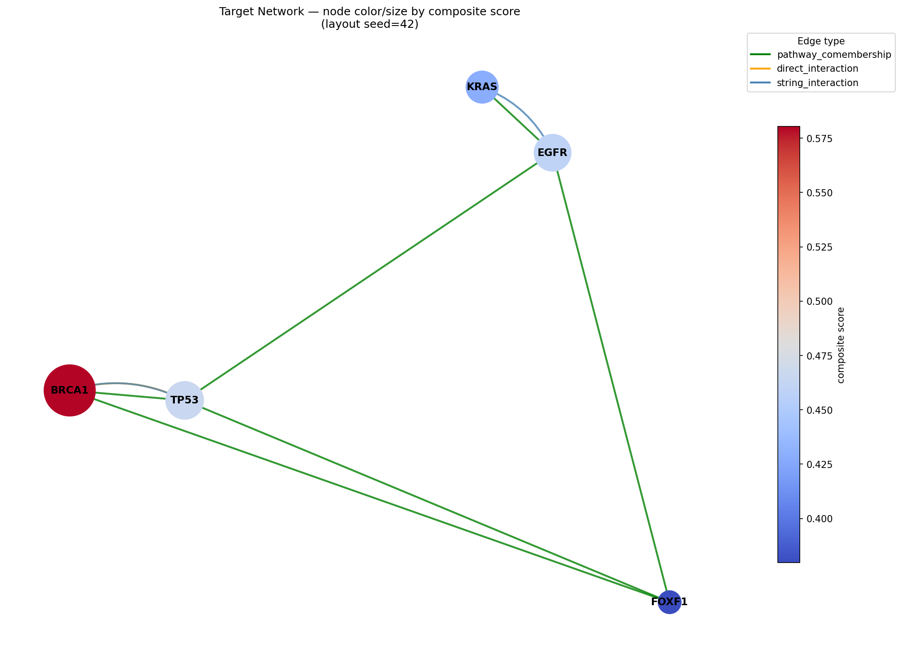
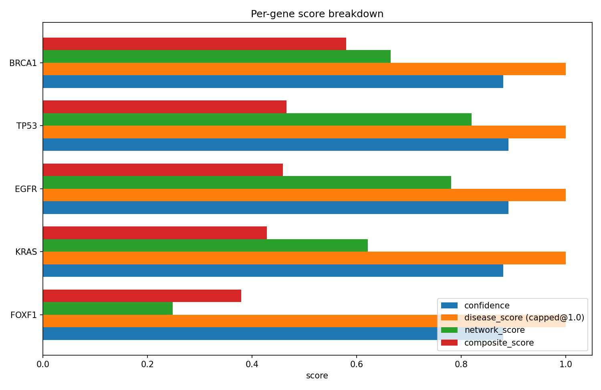
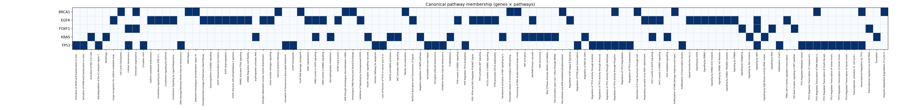
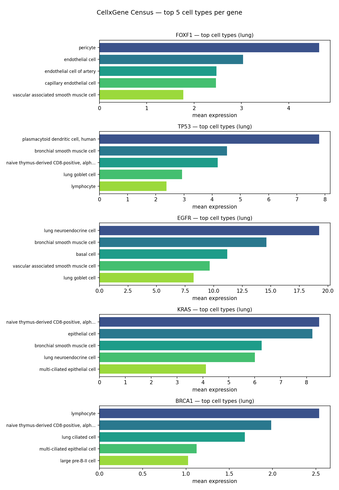

# Biological Annotation Agentic Pipeline


## Overview

This pipeline ingests a list of gene/protein targets and produces structured JSON
annotations — target functions, cellular states, pathway memberships, disease/biomarker
associations, interactors, and druggability notes — by querying PubMed, UniProt,
OpenTargets, and Reactome. It uses the Anthropic API with forced tool use to extract
structured annotations from each source and to merge them with conflict resolution, then
builds a NetworkX graph from the merged annotations to score and rank targets for
prioritization. The merged records are further enriched with database-backed signals that
bypass the LLM — STRING protein interactions, a GTEx normal-tissue safety flag, and
CellxGene Census single-cell expression — which feed both the graph and the prioritization
composite.

Configuration is centralized in a single dataclass ([`src/config.py`](src/config.py)) that
reads every environment variable in one place; the shared Anthropic tool-use call pattern
lives in [`src/llm.py`](src/llm.py); and all pathway canonicalization (exact / synonym /
fuzzy matching) is shared from [`src/pathways.py`](src/pathways.py). The orchestrator adds
an on-disk **resume cache** (re-runs skip genes already computed under the same inputs), a
**progress bar**, and an end-of-run **report** summarizing gene outcomes, pathway quality,
LLM token usage, estimated cost, and runtime. A `tests/` suite (95 tests) covers config,
caching, pathway matching, retry, network scoring, the two-tier GTEx safety filter, the HTML
report, and the run-stats accounting.

> For the full per-stage logic, the composite-score model, the cache internals, and the
> **caveats** that affect how to read the outputs, see [`docs/PIPELINE.md`](docs/PIPELINE.md).

## Architecture

```
inputs/target_genes.txt
        │
        ▼
┌──────────────────────────────────────────────────┐
│  fetchers/  (async, per gene)                    │
│   ├─ pubmed.py       → abstracts + PMIDs         │
│   ├─ uniprot.py      → function, GO, locations   │
│   ├─ opentargets.py  → pathways, disease assoc.  │
│   ├─ reactome.py     → canonical pathway names   │
│   ├─ string_db.py    → PPI partners (≥700)       │
│   └─ cellxgene.py    → single-cell expr (Census) │
└──────────────────────────────────────────────────┘
        │  raw source text (per gene, per source)
        │  [string_db + cellxgene output skip the LLM — see below]
        ▼
┌───────────────────────────────────────────────┐
│  extractor.py   (model: EXTRACTION_MODEL,     │
│   tool use, cached system+tools prompt)       │
│   one structured annotation per source        │
└───────────────────────────────────────────────┘
        │  list of per-source annotations
        ▼
┌───────────────────────────────────────────────┐
│  merger.py      (model: MERGE_MODEL, tool use)│
│   reconcile sources, resolve conflicts, then  │
│   canonicalize pathways via src/pathways.py   │
│   (exact → synonym map → gene-token-guarded   │
│   fuzzy); unresolved → NON-CANONICAL: prefix  │
└───────────────────────────────────────────────┘
        │  one merged annotation per gene
        ▼
┌──────────────────────────────────────────────────────┐
│  filters/gtex_safety.py                              │
│   flag high normal-tissue expression (GTEx v8) →     │
│   attach safety_assessment to each merged record     │
└──────────────────────────────────────────────────────┘
        │
        ▼
┌──────────────────────────────────────────────────────┐
│  fetchers/cellxgene.py  (CellxGene Census)           │
│   mean expression per cell type in tissue →          │
│   attach cellxgene_expression; union top cell        │
│   types into cellular_states                         │
└──────────────────────────────────────────────────────┘
        │
        ▼
┌──────────────────────────────────────────────────────┐
│  network.py     (NetworkX)                           │
│   build graph (pathway_comembership, direct_inter-   │
│   action, string_interaction edges; + STRING         │
│   satellite nodes) + compute priority scores         │
│   (cellxgene_score term; GTEx tier-1 ×0.60 /          │
│    tier-2 ×0.80 safety penalty)                       │
└──────────────────────────────────────────────────────┘
        │
        ▼
   outputs/runs/{timestamp}/  (annotations.jsonl, final_annotations.json,
              target_network.gpickle, prioritized_targets.tsv)
              └─ outputs/latest ─▶ this run
```

The orchestrator [`pipeline.py`](pipeline.py) drives this flow with a concurrency limit of
3 genes at a time (`SEMAPHORE_LIMIT`), per-gene retry on transient transport errors, and
error isolation so one gene's failure never kills the run. Before running a gene's stages it
consults a **two-layer resume cache** (`outputs/cache/`): a final-layer hit reuses the whole
enriched record, while a raw-layer hit replays only merge + enrich from cached extractions —
so editing the pathway synonym map skips all fetch + extraction calls (the merge model still
runs for multi-source genes; see [Resume cache](#resume-cache)).
Each run's artifacts are written to a **timestamped directory**,
`outputs/runs/{YYYYMMDD_HHMMSS}/`, so consecutive runs never overwrite one another;
`outputs/latest` is a symlink kept pointing at the most recent run, and reader tools
(visualization, Cytoscape export, synonym rebuild) resolve it automatically (override with
`RUN_DIR`; see [Run directories](#run-directories)). The **resume cache is shared** across
runs and therefore lives outside the timestamped directory, at `outputs/cache/`. Within a run
that directory is the single source of truth between stages. STRING is the one fetcher whose
output is factual rather than free text, so its PPI partners **bypass the LLM extractor and
merger** and are attached to each merged record directly, feeding `network.py` as
`string_interaction` edges (and satellite interactor nodes). Likewise, the GTEx safety
filter ([`src/filters/gtex_safety.py`](src/filters/gtex_safety.py)) is a lookup, not an LLM
call: it attaches a **two-tier** `safety_assessment` to each merged record so `network.py`
can deprioritize targets that are highly expressed in sensitive normal tissues — a tier-1
vital-organ flag applies a ×0.60 composite penalty, a tier-2 secondary-tissue flag ×0.80
(see [Normal-tissue safety](#quality-gates)). The CellxGene
Census fetcher ([`src/fetchers/cellxgene.py`](src/fetchers/cellxgene.py)) likewise bypasses
the LLM: it measures mean per-cell-type expression in the configured tissue, attaches a
`cellxgene_expression` block to each record, unions the top cell types into
`cellular_states` (prefixed `CellxGene: `), and feeds a `cellxgene_score` into the
prioritization composite.

Both LLM stages use **prompt caching**: the (static) system prompt and tool schema are
marked `cache_control: ephemeral`, so after the first call the shared prefix is served from
cache rather than re-billed on every gene. The models are env-configurable
(`EXTRACTION_MODEL`, `MERGE_MODEL`) rather than hardcoded.

Both stages also run at **`temperature=0`** (greedy decoding). Extraction and merge are
faithful, evidence-grounded tasks — pull structured facts from the source text, reconcile them
across sources — so deterministic decoding is both the correct default and what keeps results
reproducible across reruns (a cold `FORCE_RERUN` re-runs extraction; an
`EXTRACT_PROMPT_VERSION` bump or a final-cache-invalidating config change re-runs merge). The
interactive path sets this in `src/extractor.py`/`src/merger.py` via the shared
`src/llm.py:call_tool(temperature=…)` helper; the Batch path sets it per request in
`batch_pipeline.py`. Note temp-0 is near-deterministic (greedy), not a bit-identical guarantee.

## Quick Start

From a clean checkout:

```bash
# 1. Create and activate the environment
mamba create -n bio_annot python=3.11 -y
mamba activate bio_annot

# 2. Install Python dependencies
pip install -r requirements.txt

# 3. Configure secrets (see below for what each key is and where to get it)
cp env.example .env
$EDITOR .env

# 4. Download the canonical Reactome pathway reference (human only)
mkdir -p refs
curl -s "https://reactome.org/download/current/ReactomePathways.txt" \
  | awk -F'\t' '$3=="Homo sapiens" {print $2}' \
  > refs/reactome_pathways.txt

# 5. Provide a gene list (one HGNC symbol per line)
mkdir -p inputs
printf "FOXF1\nTP53\nEGFR\nKRAS\nBRCA1\n" > inputs/target_genes.txt

# 6. Run the pipeline
python pipeline.py
```

### Required environment variables (`.env`)

Fill these into your `.env` file (never commit it — it is git-ignored):

| Key | Required | Purpose | Where to get it |
|---|---|---|---|
| `ANTHROPIC_API_KEY` | Yes | Authenticates the Anthropic API used by the extractor and merger | <https://console.anthropic.com/> → API Keys |
| `NCBI_EMAIL` | Yes | NCBI Entrez policy requires a contact email on every request | Your own email address |
| `NCBI_API_KEY` | Optional | Raises the NCBI rate limit from 3 → 10 requests/sec | NCBI account → Settings → API Key Management |
| `CONFIDENCE_THRESHOLD` | Optional | Drops extractions below this confidence (default `0.65`) | — |
| `DISEASE_CONTEXT` | Optional | Single disease label that focuses the run (default `cancer`; e.g. `fibrosis`, `neurodegeneration`) | — |
| `DISEASE_TERMS` | Optional | Comma-separated synonym list for the context (default `cancer,tumor,carcinoma,sarcoma,lymphoma,leukemia`) | — |
| `EXTRACTION_MODEL` | Optional | Model for per-source extraction (default `claude-opus-4-8`) | — |
| `MERGE_MODEL` | Optional | Model for multi-source merge (default `claude-sonnet-4-6`) | — |
| `ENABLE_CELLXGENE` | Optional | Toggle the CellxGene Census single-cell step (default `true`) | — |
| `CENSUS_VERSION` | Optional | Pinned CellxGene Census release for reproducibility (default `2024-07-01`) | — |
| `CENSUS_TISSUE` | Optional | `tissue_general` to query for single-cell expression (default `lung`). **Must exactly match** a Census `tissue_general` category — the filter is a case-sensitive string equality, so `adrenal gland` works but `Adrenal gland` or `muscle` (the muscle category is `musculature`) silently return zero cells | — |
| `CENSUS_MIN_CELLS` | Optional | Drop cell types with fewer cells than this (default `50`) | — |
| `CENSUS_CACHE_DIR` | Optional | Where per-(gene, tissue) Census results are cached (default `refs/census_cache/`) | — |
| `RUN_DIR` | Optional | Directory this run writes its artifacts to (default `outputs/runs/{timestamp}/`, freshly timestamped per run). Set it to pin a run to a specific directory, or — for a reader tool — to load a specific past run instead of `outputs/latest` | — |
| `ENABLE_CACHE` | Optional | Two-layer on-disk resume cache; re-runs skip already-computed work (default `true`) | — |
| `CACHE_DIR` | Optional | Cache root, **shared across runs** (not under the per-run directory); holds `raw/` (extractions) and `final/` (enriched records) (default `outputs/cache/`) | — |
| `FORCE_RERUN` | Optional | Bypass **both** cache layers and recompute the whole chain; still rewrites both (default `false`) | — |
| `FORCE_REMERGE` | Optional | Bypass the **final** layer only; replay merge + enrich from the raw cache (skips fetch + extract — merge model still runs for multi-source genes). Forces that replay even when nothing changed — synonym/reference edits already trigger it automatically via `full_key` (default `false`) | — |
| `PRUNE_CACHE` | Optional | After a successful run, delete cache files whose keys no longer match the current config (old entries from prior synonym/config changes). Disable to keep stale files without disabling the cache. Skipped under `FORCE_RERUN` (default `true`) | — |
| `FUZZY_THRESHOLD` | Optional | Min rapidfuzz score to accept a fuzzy canonical pathway match (default `85`) | — |
| `AUTO_UPDATE_SYNONYMS` | Optional | After a run, refresh `refs/pathway_synonyms.json` from this run's NON-CANONICAL names (default `false`) | — |
| `SYNONYM_MODEL` | Optional | Model the synonym builder uses for ambiguous names (default `claude-sonnet-4-6`) | — |
| `LOG_LEVEL` | Optional | Logging verbosity (default `INFO`) | — |

Additional tunables (all optional, with sensible defaults) are read by
[`src/config.py`](src/config.py): `MAX_TOKENS`, `SEMAPHORE_LIMIT`, `STRING_MIN_SCORE`,
`STRING_LIMIT`, the PubMed fetch depth (`PUBMED_MAX_RESULTS` = relevance-ranked candidate
pool, default `50`; `PUBMED_EXTRACT_LIMIT` = best N passed to the extractor, default `20`),
the extractor's `EXTRACTION_MAX_WORDS` truncation budget (default `5000`), the two-tier GTEx
safety filter (`GTEX_VITAL_TPM_THRESHOLD` = tier-1 threshold, default `5.0`;
`GTEX_TPM_THRESHOLD` = tier-2 threshold, default `10.0`; `GTEX_TIER2_MIN_TISSUES`, default
`2`; `GTEX_TIER1_PENALTY`, default `0.60`; `GTEX_TIER2_PENALTY`, default `0.80`), the scoring
weights (`WEIGHT_BETWEENNESS`, `WEIGHT_DEGREE`, `WEIGHT_DISEASE`, `WEIGHT_DRUGGABILITY`,
`WEIGHT_CELLXGENE` — validated to sum to `1.0` at startup), `SYNONYM_CANDIDATES`, and the plot
layout (`LAYOUT_SEED`, `LAYOUT_K`). See [`env.example`](env.example) for a working starting
point.

### Disease context

The run is no longer hardcoded to oncology. `DISEASE_CONTEXT` sets a single label and
`DISEASE_TERMS` a comma-separated synonym list; together they are resolved once by
`utils.load_disease_context()` and wired into three places: the PubMed search query (a short
OR-clause built from the context plus the first couple of terms and a generic `disease`
catch-all), the extractor's system prompt, and the prioritization scoring (a disease
association counts toward `disease_score` when any term matches its name). To retarget the
pipeline at, say, fibrosis, set `DISEASE_CONTEXT=fibrosis` and
`DISEASE_TERMS=fibrosis,fibrotic,scarring` — no code changes. This replaces the old
single-term `DISEASE_FILTER` variable.

### Single-cell grounding (CellxGene Census)

When `ENABLE_CELLXGENE=true`, each gene is also queried against the
[CellxGene Census](https://chanzuckerberg.github.io/cellxgene-census/) (`cellxgene-census`,
`tiledbsoma`). For the configured `CENSUS_TISSUE` it computes the mean expression per
`cell_type` (cell types below `CENSUS_MIN_CELLS` are dropped), attaches the result as
`cellxgene_expression`, and unions the top 5 cell types into `cellular_states` with a
`CellxGene: ` prefix so measured states are distinguishable from LLM-extracted ones. Results
are cached to `CENSUS_CACHE_DIR/{gene}_{tissue}.json`.

> **First-run cost.** The Census is an S3-backed dataset; a single tissue query scans
> millions of cells and can take **10–20 minutes per uncached gene** (e.g. a lung query
> touches ~3.7M cells). Results are cached per (gene, tissue), so subsequent runs return in
> milliseconds. Set `ENABLE_CELLXGENE=false` to skip the step entirely. Note that
> `cellxgene-census`/`anndata` currently require `pandas < 3`, so installing them pins pandas
> to the 2.x line.

### Pathway canonicalization

The merger no longer only does exact matching against the Reactome reference. Pathway names
are resolved through [`src/pathways.py`](src/pathways.py) in priority order: (a) **exact**
normalized match (case-insensitive, with the Reactome `(R-HSA-…)` stable-ID suffix
stripped); (b) the **synonym map** `refs/pathway_synonyms.json` (informal → canonical); (c)
**fuzzy** `rapidfuzz` `token_sort_ratio` ≥ `FUZZY_THRESHOLD`, guarded by a *gene-token guard*
that rejects high-scoring wrong-gene siblings (e.g. "Signaling by BRCA1 mutants" vs
"Signaling by AMER1 mutants"). Anything that resolves becomes the exact canonical Reactome
string; anything that doesn't keeps the `NON-CANONICAL: ` prefix.

The synonym map is built offline by [`scripts/build_synonyms.py`](scripts/build_synonyms.py),
which scans the latest run's `final_annotations.json` (via `outputs/latest`, or the run named
by `RUN_DIR` — which the pipeline sets when it invokes the script under
`AUTO_UPDATE_SYNONYMS`) for NON-CANONICAL names and resolves each with a
local-first cascade — exact, then fuzzy over the full reference, and only the genuinely
ambiguous remainder goes to `SYNONYM_MODEL` in a single call (each name with its top
candidates; the model's choice is validated against the reference before being kept). It is
incremental (already-mapped names are skipped) and validates every entry, so a lookup can
only ever yield a real Reactome name. Run it directly, or set `AUTO_UPDATE_SYNONYMS=true` to
have the pipeline refresh the map after each run so the next run's fuzzy step improves.

```bash
python scripts/build_synonyms.py
```

### Run directories

Each run writes its artifacts to a **timestamped directory**,
`outputs/runs/{YYYYMMDD_HHMMSS}/`, rather than overwriting flat files under `outputs/`. This
keeps every run's `annotations.jsonl`, `final_annotations.json`, `target_network.gpickle`,
`prioritized_targets.tsv`, per-source `raw/{gene}_raw.json`, `pipeline.log`, and (batch mode)
`batch_id.txt` side by side, so results are comparable and reproducible across runs.

After the directory is created, the pipeline updates `outputs/latest` — a relative symlink —
to point at it (falling back to writing the path into `outputs/latest.txt` on filesystems
without symlink support). Reader tools resolve which run to load in this order: `$RUN_DIR` if
it names an existing directory → `outputs/latest` → `outputs/` (legacy/first-run fallback). So
`python visualize_network.py` and `python scripts/export_cytoscape.py` operate on the newest
run by default; set `RUN_DIR=outputs/runs/<ts>` to target a specific past run.

The **resume cache is deliberately not** inside the per-run directory — it stays at
`CACHE_DIR` (`outputs/cache/`, shared) so caching survives from one run to the next. Old run
directories accumulate under `outputs/runs/`; prune them manually when no longer needed.

### Resume cache

When `ENABLE_CACHE=true` (default), the pipeline keeps a **two-layer** on-disk cache under
`CACHE_DIR` (`outputs/cache/`), shared across runs (not under the per-run directory). Splitting the cache means that curating pathway annotations —
editing the synonym map or the Reactome reference — refreshes the output **without** paying
for fetch + extraction again.

```
                              run_gene(gene)
                                    │
                  ┌─────────────────▼──────────────────────────┐
                  │ Layer 2 — final cache                      │
                  │ outputs/cache/final/{gene}_{full_key}.json │
                  └─────────────────┬──────────────────────────┘
                       HIT ◄────────┤────────► MISS
                  return enriched   │   ┌─────────────────────────────────────────────┐
                  record (no work)  │   │ Layer 1 — raw extraction cache              │
                                    │   │ outputs/cache/raw/{gene}_{extract_key}.json │
                                    │   └──────────┬──────────────────────────────────┘
                                    │     HIT ◄────┤────► MISS
                                    │  skip fetch  │   fetch + extract (API),
                                    │  + extract   │   then write raw cache
                                    │     │        │        │
                                    │     └───►  merge + enrich  ◄───┘
                                    │              │
                                    │      write final cache, return
```

**Layer 1 — raw extraction cache** (`outputs/cache/raw/{gene}_{extract_key}.json`) holds the
high-confidence per-source extractions that feed the merge. `extract_key` digests the
fetch + extract inputs **only**: gene symbol, disease context (which shapes the PubMed query
and the extractor prompt), extraction model, PubMed depth, and an extraction-prompt version.
It deliberately **excludes** the synonym map, the Reactome reference, and every merge/enrich
parameter — so a synonym edit never invalidates it.

**Layer 2 — final enriched cache** (`outputs/cache/final/{gene}_{full_key}.json`) holds the
final enriched record (unchanged schema). `full_key` is `extract_key` **plus** the merge
model, the **content hash** of `refs/pathway_synonyms.json` and `refs/reactome_pathways.txt`,
and the enrich params (CellxGene tissue/version + toggle, STRING thresholds, GTEx
thresholds). Editing the synonym map or the Reactome reference changes only this key.

| Layer | Path | Key includes | Invalidated by |
|---|---|---|---|
| Raw extraction | `cache/raw/{gene}_{extract_key}.json` | gene, disease context, extraction model, PubMed depth, extraction-prompt version | gene/source/disease/extraction-model/prompt change — **not** synonym/reference edits, the confidence threshold, or merge/enrich params |
| Final enriched | `cache/final/{gene}_{full_key}.json` | `extract_key` + synonym-file hash + Reactome-file hash + confidence threshold + merge model + enrich params | any of the above **or** any synonym/reference/threshold/merge/enrich change |

**Execution order** in `run_gene`: (1) final-cache hit → return the record, no work; (2) else
raw-cache hit → skip fetch + extract and replay merge + enrich (**no fetch/extract API
calls**); (3) else run the full chain and write the raw cache. The final cache is always
written at the end.

**Flags:**

- `ENABLE_CACHE=false` — disable both layers.
- `FORCE_RERUN=true` — bypass **both** layers; recompute the whole chain (re-fetch,
  re-extract, re-merge) and rewrite both caches.
- `FORCE_REMERGE=true` — bypass the **final** layer only; replay merge + enrich from the raw
  cache and rewrite the final cache. Skips fetch + extraction; the merge model still runs for
  multi-source genes, so it is free for single-source genes and otherwise costs only merge
  tokens — far cheaper than a full rerun.

**Curate pathways cheaply.** Because `full_key` includes the synonym-file hash but
`extract_key` does not, editing `refs/pathway_synonyms.json` (e.g. via
`scripts/build_synonyms.py`) automatically makes every gene's final cache stale while its raw
cache stays valid. The next run therefore takes the raw-cache path — replaying merge + enrich
with the new synonyms and **no fetch or extraction API calls** (the canonicalization that a
synonym edit changes is local; the merge model only re-runs for multi-source genes, billing
merge tokens, and single-source genes re-canonicalize for free):

```bash
# 1. curate the synonym map (local-first; see Pathway canonicalization)
python scripts/build_synonyms.py

# 2. rerun — synonym edits already invalidate the final layer, so this alone
#    replays merge + enrich from the raw cache (no fetch/extract; merge tokens only
#    for multi-source genes). FORCE_REMERGE=true forces the same path even when
#    nothing changed.
python pipeline.py
```

The run report's *Genes* block shows how this resolved: `Remerged` counts genes served from
the raw cache (merge + enrich rerun, no fetch/extract API calls), `Cached` counts whole-record
final-cache hits, and the *LLM Usage* `Calls` line reflects only merge calls for the remerged
genes (the single-source merge path makes no LLM call at all).

> **Migration note.** Caches written before this change were flat files
> (`outputs/cache/{gene}_{key}.json`). They are not read by the new `raw/` and `final/`
> layers; the pipeline logs a warning if it finds any and ignores them. They are safe to
> delete once a full run has repopulated `outputs/cache/raw/` and `outputs/cache/final/`.

## Repository Layout

```
bio-annotation-pipeline/
├── README.md                   ← this file
├── requirements.txt
├── env.example
│
├── inputs/
│   └── target_genes.txt        ← one gene symbol per line (e.g. FOXF1, TP53, EGFR)
│
├── refs/
│   ├── reactome_pathways.txt   ← canonical Reactome pathway names (one per line)
│   ├── pathway_synonyms.json   ← informal→canonical pathway map (built by script)
│   ├── uniprot_surface.txt     ← surface proteome gene list (optional filter)
│   ├── gtex_median_tpm.gct.gz  ← GTEx v8 median-TPM table (auto-downloaded, cached)
│   └── census_cache/           ← per-(gene, tissue) CellxGene results (git-ignored)
│
├── src/
│   ├── config.py               ← centralized env-driven config dataclass
│   ├── llm.py                  ← shared Anthropic forced-tool-use + caching helper
│   ├── pathways.py             ← shared pathway canonicalization (exact/synonym/fuzzy)
│   ├── fetchers/
│   │   ├── pubmed.py           ← PubMed/Entrez abstract fetcher
│   │   ├── uniprot.py          ← UniProt REST API fetcher
│   │   ├── opentargets.py      ← OpenTargets GraphQL fetcher
│   │   ├── reactome.py         ← Reactome pathway fetcher
│   │   ├── string_db.py        ← STRING PPI interaction-partner fetcher
│   │   └── cellxgene.py        ← CellxGene Census single-cell expression fetcher
│   ├── filters/
│   │   └── gtex_safety.py      ← GTEx normal-tissue expression safety filter
│   ├── extractor.py            ← Anthropic API tool-use extraction core
│   ├── merger.py               ← LLM-assisted multi-source merge & conflict resolution
│   ├── network.py              ← NetworkX graph builder + target prioritization scorer
│   └── utils.py                ← logging, retry decorator, PMID validator
│
├── scripts/
│   ├── build_synonyms.py       ← build/update refs/pathway_synonyms.json
│   ├── export_cytoscape.py     ← export network to Cytoscape.js JSON + CX2
│   └── generate_report.py      ← self-contained HTML report (auto-run at end of pipeline)
│
├── tests/                      ← pytest suite (95 tests)
│
├── pipeline.py                 ← main orchestrator (run this)
├── batch_pipeline.py           ← Anthropic Batch API variant for 50+ genes
├── visualize_network.py        ← plots from existing outputs (no rerun)
│
└── outputs/                    ← auto-created at runtime
    ├── cache/                  ← two-layer resume cache, SHARED across runs (git-ignored)
    │   ├── raw/                ← Layer 1: cached extractions, keyed by extract_key
    │   └── final/             ← Layer 2: enriched records, keyed by full_key
    ├── latest ─▶ runs/{ts}     ← symlink to the most recent run
    └── runs/
        └── {YYYYMMDD_HHMMSS}/  ← one timestamped directory per run
            ├── raw/                    ← per-gene per-source raw extraction JSONs (provenance)
            ├── annotations.jsonl       ← merged annotation per gene (newline-delimited JSON)
            ├── final_annotations.json  ← full merged dict keyed by gene symbol
            ├── target_network.gpickle  ← NetworkX graph
            ├── target_network_cytoscape*.json / *.cx2  ← Cytoscape exports (auto-generated)
            ├── prioritized_targets.tsv ← ranked target table
            ├── bioannot_report.html    ← self-contained HTML report (auto-generated)
            ├── pipeline.log            ← this run's log
            └── plots/                  ← visualization PNGs (auto-generated)
```

## Output Files

Each run's outputs land in its own timestamped directory, `outputs/runs/{timestamp}/`, with
`outputs/latest` pointing at the newest run. The paths below are shown relative to that run
directory (i.e. `<run>/` means `outputs/runs/{timestamp}/`, reachable as `outputs/latest/`).

- **`<run>/raw/{gene}_raw.json`** — the per-source annotation records (PubMed, UniProt,
  OpenTargets) for one gene before merging. Useful for debugging where an annotation came
  from or why a source was dropped below the confidence threshold.

- **`<run>/annotations.jsonl`** — one merged annotation per line (newline-delimited
  JSON), appended as each gene completes. Convenient for streaming/`jq` processing and as
  an incremental record even if a later gene fails.

- **`<run>/final_annotations.json`** — the full merged dictionary keyed by gene symbol,
  written once at the end. This is the canonical structured result. Each value contains
  `functions`, `cellular_states`, `pathways` (non-canonical names prefixed
  `NON-CANONICAL: `), `disease_associations` (each with `role` and `evidence_strength`),
  `interactors`, `druggability_notes`, `confidence`, `source_count`, `source_pmids`, and
  `merged_at`. When the enrichment steps run, records also carry `string_interactors`,
  `safety_assessment` (the two-tier GTEx result: `safety_flag`, `tier1_flag`, `tier2_flag`,
  `tier1_high_tissues` / `tier2_high_tissues` as `{tissue: TPM}`, `max_vital_tpm`, `max_tpm`,
  `safety_penalty`, and `high_expression_tissues`), and `cellxgene_expression` (`tissue`,
  `census_version`, the top 10 `{cell_type, mean_expr}` entries, and `cell_type_count`); the
  top measured cell types also appear in `cellular_states` with a `CellxGene: ` prefix.

- **`<run>/prioritized_targets.tsv`** — the ranked target table, one row per gene sorted
  by `composite` descending. Columns: `gene`, `composite`, `betweenness`, `degree`,
  `disease_score`, `druggability_bonus`, `cellxgene_score`, `confidence`, `safety_flag`,
  `tier1_flag`, `tier2_flag`, `safety_penalty`, `safety_penalty_applied`,
  `tier1_high_tissues`, `high_expression_tissues`, `max_vital_tpm`, `max_tpm`, `pathways`,
  `disease_associations` (list/dict fields flattened to pipe-separated strings). The
  composite is:

  ```
  composite = (0.25·betweenness + 0.15·degree + 0.35·min(disease_score, 1.0)
               + 0.10·druggability_bonus + 0.15·cellxgene_score)
              × confidence × safety_penalty
  ```

  `cellxgene_score` is `1.0` for genes with measured expression in ≥3 cell types, `0.5` for
  ≥1, else `0.0`. `safety_penalty` is the two-tier GTEx multiplier: `0.60` for a tier-1
  (vital-organ) flag, `0.80` for a tier-2-only flag, else `1.0` (`safety_penalty_applied`
  records whether any penalty was applied). `disease_score` is capped at `1.0` inside the
  composite, though the raw uncapped value is still reported in its own column.

- **`<run>/target_network.gpickle`** — the NetworkX graph (a `MultiDiGraph`) pickled to
  disk. It holds the 5 (or however many) target nodes (`node_type="target"`, carrying the
  full annotation as attributes) plus satellite interactor nodes (`node_type="interactor"`)
  — the STRING partners of the targets, added so otherwise-isolated genes gain connectivity.
  Edge types are `pathway_comembership` (genes sharing ≥1 pathway), `direct_interaction`
  (a gene to a named LLM-extracted interactor that is also a node), and `string_interaction`
  (STRING PPI partners, weighted by `combined_score` on the 0–1000 scale — between two
  targets, or from a target to a satellite). Centrality is computed over the whole graph but
  only target nodes are scored and written to the TSV. Pass
  `build_target_network(..., include_interactor_nodes=False)` for a target-only graph with
  no satellites (cleaner for larger gene sets). Load with `pickle.load(open(path, "rb"))`.

- **`<run>/bioannot_report.html`** — a self-contained HTML report generated automatically
  at the end of every run (see [HTML Report](#html-report)). Opens by double-click; bundles
  the per-gene annotations, priority ranking, an interactive network graph, the plots, and a
  pathway matrix into one file.

## Example Results

A real end-to-end run over five genes (`FOXF1, TP53, EGFR, KRAS, BRCA1`) with
`DISEASE_CONTEXT=cancer` and CellxGene grounding enabled. _(Outputs are LLM-generated and will
vary run to run; these are illustrative.)_

### Run report — cold run

A first run with empty caches runs the full chain for every gene:

```
╔══════════════════════════════════════════════════════╗
║                 BioAnnot Run Report                  ║
╠══════════════════════════════════════════════════════╣
║ Genes                                                ║
║   Total:      5     Succeeded: 5                     ║
║   Failed:     0     Cached:    0                     ║
║   Remerged:   0    (raw-cache, no fetch/extract)     ║
╠══════════════════════════════════════════════════════╣
║ Pathway Quality                                      ║
║   NON-CANONICAL: 5/113 (4.4%)                        ║
╠══════════════════════════════════════════════════════╣
║ LLM Usage                                            ║
║   Calls:      19                                     ║
║   Input:      65240    tokens                        ║
║   Output:     21129    tokens                        ║
║   Cache read: 22820    tokens                        ║
║   Cache hit:  89.4%                                  ║
║   Est. cost:  $0.5296                                ║
╠══════════════════════════════════════════════════════╣
║ Runtime: 5m 26s                                      ║
╚══════════════════════════════════════════════════════╝
```

### Run report — synonym edit (re-merge + prune)

After editing `refs/pathway_synonyms.json`, the next run replays merge + enrich from the raw
cache (no fetch/extract) and prunes the stale-key files left behind — note the disjoint
`Succeeded`/`Remerged` counters and the much lower cost:

```
╔══════════════════════════════════════════════════════╗
║                 BioAnnot Run Report                  ║
╠══════════════════════════════════════════════════════╣
║ Genes                                                ║
║   Total:      5     Succeeded: 0                     ║
║   Failed:     0     Cached:    0                     ║
║   Remerged:   5    (raw-cache, no fetch/extract)     ║
║   Cache pruned: 0 raw, 14 final                      ║
╠══════════════════════════════════════════════════════╣
║ ...                                                  ║
║   Calls:      4          Est. cost:  $0.1657         ║
║ Runtime: 1m 40s                                      ║
╚══════════════════════════════════════════════════════╝
```

### One annotation (`<run>/final_annotations.json` → `FOXF1`, trimmed)

```jsonc
{
  "gene_symbol": "FOXF1",
  "functions": [
    "sequence-specific DNA-binding transcription factor",
    "suppression of fibroblast proliferation and collagen synthesis",
    "transcriptional activator of EZH2"
  ],
  "cellular_states": [
    "pulmonary fibroblasts", "alveolar epithelial cells",
    "CellxGene: pericyte", "CellxGene: endothelial cell",      // measured, prefixed
    "CellxGene: capillary endothelial cell"
  ],
  "pathways": [
    "Signaling by Hedgehog", "Cellular Senescence", "Signaling by WNT",
    "NON-CANONICAL: JAK-STAT signaling"                         // unresolved → flagged
  ],
  "disease_associations": [
    { "disease": "B-cell acute lymphoblastic leukemia (B-ALL)",
      "role": "oncogene", "evidence_strength": "strong" }
  ],
  "confidence": 0.88,
  "source_count": 3,
  "string_interactors": ["..."],
  "safety_assessment": { "safety_flag": true, "tier1_flag": true, "tier2_flag": false,
                         "tier1_high_tissues": { "Liver": 42.5 }, "max_vital_tpm": 42.5,
                         "safety_penalty": 0.6 },
  "cellxgene_expression": { "tissue": "lung", "cell_type_count": 12, "top_cell_types": ["..."] }
}
```

### Prioritized targets (`<run>/prioritized_targets.tsv`, selected columns)

| gene | composite | betweenness | degree | disease_score | cellxgene_score | confidence | safety_flag |
|---|---|---|---|---|---|---|---|
| BRCA1 | 0.580 | 0.397 | 0.268 | 7.2 | 1.0 | 0.88 | False |
| TP53 | 0.466 | 0.546 | 0.274 | 14.4 | 1.0 | 0.89 | True |
| EGFR | 0.459 | 0.507 | 0.274 | 6.7 | 1.0 | 0.89 | True |
| KRAS | 0.428 | 0.358 | 0.263 | 7.0 | 1.0 | 0.88 | True |
| FOXF1 | 0.380 | 0.180 | 0.068 | 3.0 | 1.0 | 0.88 | True |

(`disease_score` is reported uncapped here but capped at 1.0 inside the composite; the full TSV
also carries `druggability_bonus`, `tier1_flag`, `tier2_flag`, `safety_penalty`,
`safety_penalty_applied`, `tier1_high_tissues`, `high_expression_tissues`, `max_vital_tpm`,
`max_tpm`, `pathways`, and `disease_associations`.)

### Plots (`python visualize_network.py` → `<run>/plots/`)

| Target network | Per-gene score breakdown |
|---|---|
|  |  |
| Nodes colored/sized by composite (red = high); green = pathway co-membership, gray = STRING PPI edges. | Confidence, capped disease_score, network (betweenness+degree), and composite per gene. |

| Canonical-pathway heatmap | CellxGene single-cell expression |
|---|---|
|  |  |
| Genes × canonical Reactome pathways presence matrix (non-canonical names excluded). | Top cell types by mean single-cell expression per gene, from the Census grounding. |

## Quality Gates

These are enforced automatically by the pipeline:

| Gate | Rule | Action |
|---|---|---|
| Confidence filter | Drop extractions < 0.65 (`CONFIDENCE_THRESHOLD`) | Log warning, skip source |
| PMID validation | Only digits, 7–8 chars | Drop invalid, log |
| Pathway canonicity | Resolve vs Reactome reference: exact → synonym map → gene-token-guarded fuzzy | Map to canonical name; unresolved get `NON-CANONICAL: ` prefix |
| Source agreement | Pathway needs ≥2 sources unless confidence ≥ 0.85 | Merger rule |
| Normal-tissue safety (tier 1) | >5 TPM in **any** vital organ (brain, heart, liver, kidney, lung, adrenal) | Hard flag; ×0.60 composite penalty (deprioritize) |
| Normal-tissue safety (tier 2) | >10 TPM in ≥2 secondary tissues (intestine, colon, spleen, skin, blood) | Soft flag; ×0.80 composite penalty (tier 1 takes precedence) |
| Rate limiting | Max 3 concurrent gene fetches | `asyncio.Semaphore(3)` |

## Batch Mode

Use [`batch_pipeline.py`](batch_pipeline.py) instead of `pipeline.py` when processing
**≥ 50 genes**. It submits all extraction requests through the Anthropic Batch API, which
delivers roughly **50% cost reduction** in exchange for asynchronous (polled) completion
rather than real-time results. For small gene sets the standard `pipeline.py` is simpler
and returns faster.

```bash
python batch_pipeline.py
```

The batch job ID is written to `<run>/batch_id.txt` (in the run's timestamped directory,
reachable as `outputs/latest/batch_id.txt`); the script polls until the batch ends, then
collects results and runs the same merge → network → output stages as the standard pipeline,
writing into the same per-run directory.

## Visualization

`pipeline.py` runs this automatically at the end of every run (to feed the HTML report), so
the four PNGs normally already exist in `<run>/plots/`. To regenerate them standalone from an
existing run's `target_network.gpickle` and `prioritized_targets.tsv`:

```bash
python visualize_network.py
```

This reads the most recent run's outputs by default (via `outputs/latest`; set `RUN_DIR` to
pick a specific past run) — no pipeline rerun — and writes four PNGs to that run's `plots/`
subdirectory (`outputs/latest/plots/`):

- **`target_network.png`** — the target graph with nodes colored and sized by composite
  score (red = high, blue = low), edges colored by type (green = pathway co-membership,
  orange = direct interaction), edge type labels, and a composite-score colorbar.
- **`score_breakdown.png`** — per-gene horizontal bars comparing confidence,
  disease_score (capped at 1.0, its effective contribution to the composite),
  network_score (betweenness + degree), and composite_score on a shared 0–1 scale.
- **`pathway_heatmap.png`** — a genes × canonical-pathways presence matrix
  (1 = gene has pathway). Non-canonical pathway names are excluded.
- **`cellxgene_expression.png`** — per-gene horizontal bars of the top 5 cell types by
  mean single-cell expression (from `cellxgene_expression`). Only genes with Census data are
  plotted; a placeholder is emitted if none have it.

## Cytoscape Export

[`scripts/export_cytoscape.py`](scripts/export_cytoscape.py) converts the most recent run's
`target_network.gpickle` into Cytoscape-importable files. `pipeline.py` runs it automatically
at the end of every run (the HTML report's Network Graph tab embeds its JSON), so these files
normally already exist; run it standalone to regenerate them (no pipeline rerun; resolves the
run via `outputs/latest`, or `RUN_DIR` for a specific one):

```bash
python scripts/export_cytoscape.py
```

It writes four files into that run's directory — Cytoscape.js JSON and CX2 (for NDEx /
Cytoscape), each in a **full**
variant (all nodes, including STRING satellite interactors) and a **targets-only** variant
(target nodes and the edges among them, for clean presentation): `target_network_cytoscape.json`,
`target_network_cytoscape_targets.json`, `target_network_cytoscape.cx2`, and
`target_network_cytoscape_targets.cx2`. Node/edge attributes are carried through; values CX2
can't represent natively (nested dicts/lists) are JSON-stringified. The CX2 step needs
`ndex2`; if it's missing those two files are skipped with a note.

## Run Report

At the end of every `pipeline.py` run a boxed report is logged and printed, summarizing:
gene outcomes (total / succeeded / failed / **cached** = final-cache hits / **remerged** =
raw-cache hits whose merge + enrich rerun with no fetch/extract API calls), pathway quality
(NON-CANONICAL count and percentage), LLM usage (calls, input/output/cache-read tokens, cache
hit rate), the estimated USD cost, and total runtime. During the run a `tqdm` progress bar
shows the current gene and whether it was computed or served from the resume cache.

## HTML Report

Every `pipeline.py` run finishes by writing a **single self-contained HTML report** to
`<run>/bioannot_report.html` (reachable as `outputs/latest/bioannot_report.html`). It opens
by double-clicking — no server — and bundles the whole run into five top-level tabs, with tab
state preserved in the URL hash (the browser back button and shareable `#`-links work):

- **Genes** — one panel per gene (confidence badge, safety banner, functions, cellular states,
  pathways, disease-association table, GeneCards-linked interactors, PubMed-linked sources,
  and the CellxGene table).
- **Priority Ranking** — the full ranked table with sortable columns and color-coded safety
  tiers (red / amber / green).
- **Network Graph** — an interactive D3 force graph (node size ∝ composite, color by safety
  tier, edges colored by type; hover for details, click a node to jump to its gene).
- **Plots** — the four PNGs embedded inline as base64.
- **Pathway Matrix** — a genes × canonical-pathways presence grid.

To build the report, the pipeline first runs `visualize_network.py` (PNG plots) and
`scripts/export_cytoscape.py` (the network JSON the graph tab embeds), then
[`scripts/generate_report.py`](scripts/generate_report.py). Each asset step is best-effort:
if one fails the run still completes and the report renders with placeholder cards. You can
also regenerate the report standalone from an existing run's outputs:

```bash
python scripts/generate_report.py    # resolves outputs/latest, or set RUN_DIR
```

> **Self-containment caveat.** The report is fully offline **except** the Network Graph tab,
> which loads D3 from cdnjs (the network *data* is inlined, so only the D3 library needs
> internet). Every other tab — including the base64-embedded plots — works with no network.

## Tests

```bash
pytest                      # 95 tests
```

The suite covers the config dataclass and weight validation, the two-layer resume cache
(raw/final key scoping, `FORCE_REMERGE`/`FORCE_RERUN` semantics, and `run_gene`'s
final→raw→full execution order with cached/remerged accounting), pathway canonicalization
(exact / synonym / fuzzy + the gene-token guard), per-gene retry behavior, network scoring,
the two-tier GTEx safety filter (tier thresholds, precedence, config-driven penalties), the
HTML report generator (tabs, links, safety banners, plot placeholders), and the
run-stats/cost accounting.

## Extension Points

Four enrichment/output layers are now **implemented**:

- **STRING PPI enrichment** (`src/fetchers/string_db.py`) — see the Architecture section and
  the `string_interaction` edges in each run's `target_network.gpickle`.
- **Two-tier GTEx safety filter** (`src/filters/gtex_safety.py`) — a tier-1 flag fires on
  >5 TPM in any single vital organ (×0.60 penalty), a tier-2 flag on >10 TPM in ≥2 secondary
  tissues (×0.80; tier 1 wins when both fire); `network.py` applies the per-tier penalty in
  the composite. The GTEx v8 median-TPM table is auto-downloaded and cached at
  `refs/gtex_median_tpm.gct.gz` on first use.
- **CellxGene Census single-cell grounding** (`src/fetchers/cellxgene.py`) — mean
  per-cell-type expression per gene in the configured tissue, grounding `cellular_states` and
  feeding the `cellxgene_score` term in the composite. See *Single-cell grounding* above.
- **Cytoscape export** (`scripts/export_cytoscape.py`) — Cytoscape.js JSON and CX2 exports
  (full + targets-only) via `nx.cytoscape_data(G)`. See *Cytoscape Export* above.

The following extension is still planned:

- **Batch-mode parity** — `batch_pipeline.py` now reads `EXTRACTION_MODEL` and uses the same
  cached extraction prompt as `pipeline.py`, but it does not yet attach STRING partners, GTEx
  safety assessments, or CellxGene expression to records, so batch-built networks lack those
  edges, penalties, and the `cellxgene_score` term.

## Known Limitations

- **LLM non-determinism causes (reduced) run-to-run variance.** The extractor and merger are
  generative. Both now run at `temperature=0` (greedy decoding), which removes most drift —
  but temp-0 is *near*-deterministic, not bit-identical, so repeated runs on the same genes can
  still occasionally return a different pathway or slightly different phrasing. Counts (e.g.
  number of `NON-CANONICAL` flags) and, rarely, the exact ranking can shift; treat individual
  runs as (now much more stable) samples, not fixed truth. In normal operation the two-layer
  cache also freezes results, so variance only surfaces when a stage actually re-runs (a
  `FORCE_RERUN`/`EXTRACT_PROMPT_VERSION` bump for extraction, or any final-cache-invalidating
  change for merge).

- **Remaining `NON-CANONICAL` flags are mostly informal signaling names.** Canonicalization
  now goes well beyond exact matching — case-insensitive comparison, Reactome `(R-HSA-…)`
  stable-ID stripping, a validated synonym map, and gene-token-guarded fuzzy matching (see
  *Pathway canonicalization*). The pathways still flagged after all that are typically
  informal shorthand the model emits — e.g. `PI3K/AKT/mTOR signaling`,
  `RAS-RAF-MEK-ERK (MAPK) cascade`, `JAK/STAT signaling` — with no close Reactome equivalent.
  These are genuine non-canonical names, not a matching bug; the gate is working as intended.
  Running `scripts/build_synonyms.py` (or `AUTO_UPDATE_SYNONYMS=true`) over time maps the
  resolvable ones so later runs flag fewer.

- **Network centrality is only meaningful on larger gene sets (≥ ~20 genes).** With a
  handful of genes the graph is too sparse for betweenness/degree centrality to carry
  signal (a 5-gene network often has just a few edges), so the network-derived component of
  the composite score is noisy at small scale. Run with a substantial target list before
  relying on the centrality terms.

- **The raw cache key intentionally excludes synonym/reference content.** `make_extract_key`
  (`pipeline.py`) digests only fetch + extract inputs, *not* `pathway_synonyms.json` or
  `reactome_pathways.txt` — by design, so curating canonicalization re-runs merge + enrich for
  free off the cached extractions instead of re-fetching and re-extracting. The synonym and
  reference file hashes live in `make_full_key` (the final layer) instead. Do **not** move them
  into `make_extract_key`: it would couple the layers and silently break the fetch/extract-free re-merge
  (the regression `tests/test_cache.py::test_extract_key_excludes_merge_and_enrich_params`
  guards against). See [Resume cache](#resume-cache).

- **`source_pmids` are unioned from inputs, not taken from the merger model.** The
  `annotate_target` tool schema has no `source_pmids` field, so the merged record's PMIDs
  are computed by unioning the validated PMIDs from the per-source inputs rather than read
  back from the merge model's output. This is deliberate (it prevents the model from
  inventing citations) but means the merged `source_pmids` reflect the input sources, not
  any model-level attribution.

## License

Released under the [MIT License](LICENSE).

